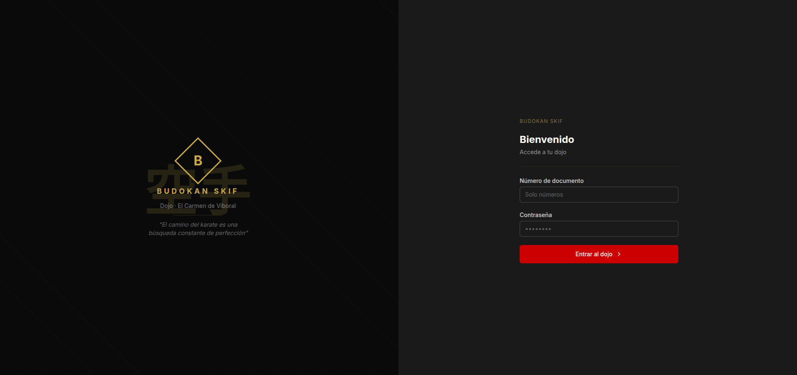
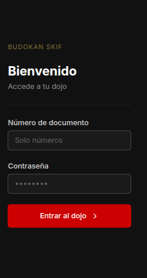
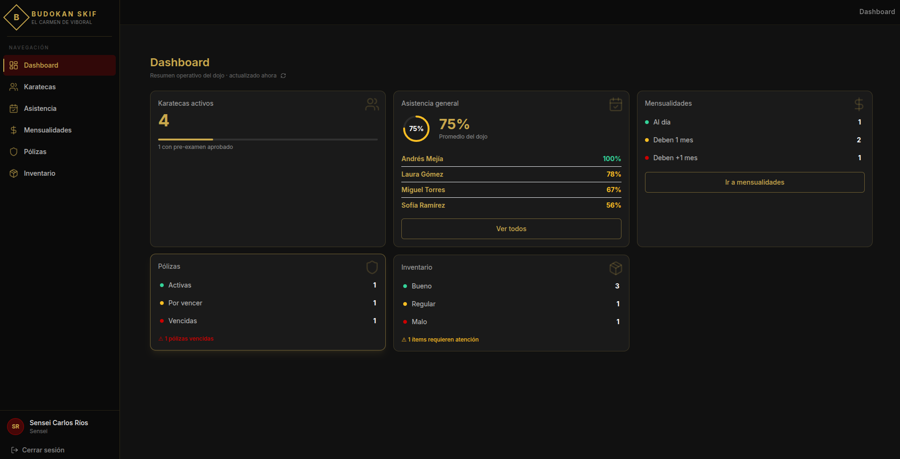
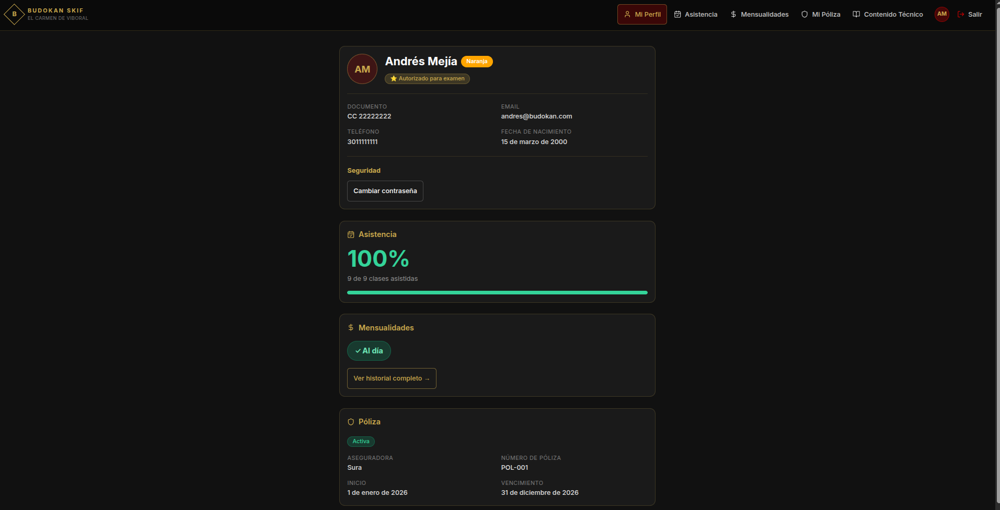
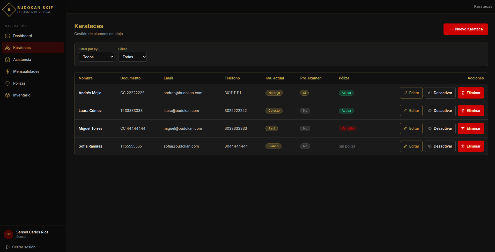
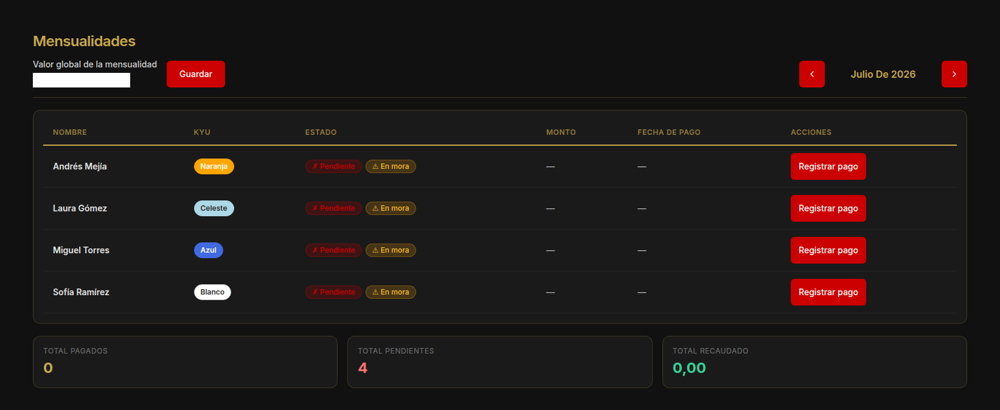

# Kensho — Dojo Management System

Production-ready full-stack web application for managing a karate dojo — students, attendance, payments, insurance policies and equipment inventory.

[](https://budokan-app.vercel.app) [](https://react.dev) [](https://nodejs.org) [](https://postgresql.org) [](https://github.com/dacq7/kensho) [](LICENSE)

---

## Screenshots

<table>
  <tr>
    <td align="center">
      <br/>
      <sub>Login Page</sub>
    </td>
    <td align="center">
      <br/>
      <sub>Mobile View</sub>
    </td>
  </tr>
  <tr>
    <td align="center">
      <br/>
      <sub>Sensei Dashboard</sub>
    </td>
    <td align="center">
      <br/>
      <sub>Karateca Dashboard</sub>
    </td>
  </tr>
  <tr>
    <td align="center">
      <br/>
      <sub>Student Management</sub>
    </td>
    <td align="center">
      <br/>
      <sub>Payment Tracking</sub>
    </td>
  </tr>
</table>

---

## Overview

Kensho is a management system built from the real operating requirements of a karate dojo in Antioquia, Colombia, where the software runs in production. **This repository is the portfolio edition**: same codebase, fictional data, public demo, client identity removed.

It supports two authenticated roles — Sensei (administrator) and Karateca (student) — each with a dedicated dashboard and scoped feature set. The system covers the full operational lifecycle of a dojo: student enrollment, kyu/dan progression tracking, attendance management, monthly fee control, insurance policy monitoring with expiry alerts, and equipment inventory.

Two details give away that this was built against a real operation rather than from a template:

- **Login is by national ID (`numeroDocumento`), not email.** The sensei holds each student's ID at enrolment; students may not have email.
- **`Poliza` — per-student insurance policies** with expiry tracking. A Colombian dojo requires them. Nobody invents that model from a tutorial.

**Kensho** (見性) is a Japanese Zen term meaning "seeing one's true nature" — clear sight of what is actually there.

---

## Features

<table>
  <tr>
    <td valign="top" width="50%">

**Sensei (Admin)**

- Live dashboard: attendance averages, payment alerts, policy expiry status, inventory warnings
- Student management: full CRUD, kyu/dan rank progression, pre-exam authorization toggle, soft delete (active/inactive)
- Attendance: per-date recording for all students, monthly history with present/absent counts
- Payments: monthly fee registration and void, global fee amount config, mora (overdue) detection after day 5
- Insurance policies: create/edit/delete per student, expiry alerts at 30 days, full policy history per student
- Inventory: equipment tracking with category (protection/instrument) and condition (good/fair/poor)
- Role-based access: all write endpoints are SENSEI-only at the API level

  </td>
  <td valign="top" width="50%">

**Karateca (Student)**

- Personal dashboard: attendance percentage with animated progress bar, payment status, active policy
- Attendance history grouped by month with collapsible detail view
- Full payment history with mora status and pending amount
- Insurance policy with days-remaining countdown and status badge
- Technical content: kata, kumite and kihon requirements specific to current kyu level
- Self-service password change

  </td>
  </tr>
</table>

---

## Tech Stack

| Layer | Technology | Purpose |
|-------|-----------|---------|
| Frontend | React 19 + Vite 8 | UI framework and build tool |
| Frontend | Tailwind CSS 3.4 | Utility-first styling with custom dojo design tokens |
| Frontend | Zustand 5 | Lightweight auth state management with localStorage persistence |
| Frontend | React Hook Form 7 + Zod 4 | Form handling with runtime schema validation |
| Frontend | React Router v7 | Client-side routing with protected route guards |
| Frontend | Lucide React | Consistent icon system |
| Frontend | @fontsource/inter | Self-hosted Inter typeface |
| Backend | Node.js + Express 5 | REST API server |
| Backend | Prisma ORM 5 | Database client with migration support |
| Backend | PostgreSQL | Relational database |
| Backend | JSON Web Tokens | Stateless authentication |
| Backend | bcryptjs | Secure password hashing |
| Testing | Jest + Supertest | Backend unit and integration tests with mocked Prisma |
| DevOps | Vercel | Frontend hosting with SPA rewrite rules |
| DevOps | Railway | Backend API and PostgreSQL hosting |

JavaScript throughout — no TypeScript. See [Key Engineering Decisions](#key-engineering-decisions).

---

## Architecture

### Project Structure

```
kensho/
├── backend/
│   ├── src/
│   │   ├── controllers/      # Route handlers (auth, karateca, asistencia, mensualidad, poliza, inventario, dashboard, config)
│   │   ├── middlewares/      # JWT auth guard, role-based access control
│   │   ├── routes/           # Express routers
│   │   ├── tests/            # Jest + Supertest test suites
│   │   └── utils/            # JWT helpers, seed scripts
│   ├── docs/
│   │   └── API.md            # Full API reference
│   └── prisma/
│       └── schema.prisma     # 7-model relational schema
├── docs/
│   ├── audit/                # Independent audit reports
│   ├── adr/                  # Architecture decision records
│   └── CHANGELOG-session.md  # Engineering session log
└── frontend/
    └── src/
        ├── components/
        │   ├── karatecas/    # KaratecasTable, KaratecasCards, NuevoKaratecaModal, EditarKaratecaModal
        │   └── ui/           # Design system: Input, Button, Badge, Card, Modal, Skeleton, EmptyState
        ├── lib/              # API client (axios), kyu utilities, date utilities
        ├── pages/
        │   ├── karateca/     # Dashboard, Asistencia, Mensualidades, Poliza, Tecnico
        │   └── sensei/       # Dashboard, Karatecas, Asistencia, Mensualidades, Polizas, Inventario
        └── store/            # Zustand auth store
```

### Database Schema

7 Prisma models with the following relationships:

- `User` (1) → (1) `Karateca`
- `Karateca` (1) → (N) `Asistencia`, `Mensualidad`, `Poliza`
- `User` (1) → (N) `Asistencia` (as `registradoPor` — the sensei who recorded attendance)
- `Inventario` and `Config` stand alone

Enums: `Rol` (`SENSEI` | `KARATECA`), `CategoriaInventario` (`PROTECCION` | `INSTRUMENTO`), `EstadoInventario` (`BUENO` | `REGULAR` | `MALO`)

Notable patterns: soft delete on `Karateca` (`activo` boolean), computed `poliza` `estado` field (`activa` | `por_vencer` | `vencida`) derived at query time, `mesInicioMensualidades` for per-student fee tracking start date.

**Domain language is Spanish** (`Karateca`, `kyuActual`, `Mensualidad`) — a deliberate choice, not an oversight. The domain experts and users are Colombian; the model speaks their vocabulary, per DDD's ubiquitous language. Documentation and this README are English.

### Design System

A custom component library was built from scratch under `src/components/ui/`:

- **Design tokens**: three brand colors (negro `#111111`, rojo `#CC0000`, dorado `#C9A84C`) extended into Tailwind config as `dojo.negro` / `dojo.rojo` / `dojo.dorado` / `dojo.surface` / `dojo.subtle`
- **Typography**: Inter (self-hosted via `@fontsource/inter`, weights 400/500/600/700) set as Tailwind's default sans font
- **Components**: `Input` (labeled, error state), `Button` (primary/secondary/ghost, sm/md), `Badge` (gold/success/danger/warning/muted), `Card` (hover lift animation when clickable), `Modal` (focus trap, Escape-to-close, mobile full-screen), `Skeleton` + `SkeletonCard` (pulse animation), `EmptyState` (icon + title + description + optional action)

### Security

- JWT Bearer authentication on all protected endpoints
- Role-based access control enforced at the middleware level — SENSEI-only routes reject KARATECA tokens with 403
- Passwords hashed with bcryptjs (10 rounds), and never returned in API responses — verified 2026-07-15 by tracing all 13 `User` queries to the response body
- Login returns a generic error regardless of whether the document exists — no user enumeration
- Frontend protected routes redirect unauthenticated users to `/login`
- Auth state hydrated from localStorage with a `hydrated` flag to prevent flash of unauthenticated content

Known gaps are listed in the [Roadmap](#roadmap) rather than omitted.

### Key Engineering Decisions

- **JavaScript, not TypeScript**: a deliberate, revisited decision. The domain is small and stable, the team is one person, and Zod already provides runtime validation at both boundaries — which is where type errors actually surface in this app. TypeScript's cost here is build complexity for a class of bug the schema and Zod already catch. The tradeoff is real and documented, not defaulted into.
- **Single-tenant by design**: there is no `Dojo` model and no `dojoId`. The system was built to run one dojo, and pretending otherwise would mean a tenancy boundary nothing currently needs. Multi-tenancy is a rewrite of every query, not a migration — see Roadmap.
- **Monorepo structure**: frontend and backend in a single repo for easier review and coordinated deploys
- **Prisma over raw SQL**: schema-driven migrations, a generated client, and query-time relation loading without hand-written joins
- **Zustand over Redux**: auth state is simple (user + token); Zustand's minimal API avoids boilerplate without sacrificing reactivity
- **Zod on both ends**: frontend forms validate with the same schema constraints as backend — consistent error messages without duplication
- **Timezone-safe date parsing**: a custom `dateUtils.js` parses ISO strings by slicing `YYYY-MM-DD` and constructing `Date(y, m-1, d)` to avoid UTC→local day-shift bugs (UTC-5 Colombia)
- **SPA routing**: `vercel.json` rewrite rule sends all routes to `index.html`, fixing 404 on browser refresh
- **Component split**: `Karatecas.jsx` (originally 617 lines) was split into 4 focused components — each under 150 lines

---

## Engineering Process

This repository documents its own audit.

In July 2026 the project was rebranded and professionalized through a structured agentic workflow: specialized agents ran read-only analysis in parallel, under a documentation contract requiring `path:line` evidence for every claim and an explicit "not verified" section for everything unchecked. Implementation ran serially, one commit per scope, with human review at each decision point.

- **[`docs/audit/`](docs/audit/)** — four independent reports: codebase map, architecture, security, product
- **[`docs/CHANGELOG-session.md`](docs/CHANGELOG-session.md)** — session log
- **[`docs/adr/`](docs/adr/)** — architecture decision records
- **[`CLAUDE.md`](CLAUDE.md)** — the operating context agents read: constraints, positioning, known issues

The part worth reading is the failures. The audit's own context file contained three incorrect findings — including a phantom security bug and an off-by-one occurrence count that propagated into three reports before a grep caught it. The corrections are logged with their origin rather than silently patched, because a process that never records being wrong is a process nobody should trust.

---

## Getting Started

### Prerequisites

- Node.js 18+
- PostgreSQL database
- Git

### Installation

```bash
git clone https://github.com/dacq7/kensho.git
cd kensho
```

**Backend:**

```bash
cd backend
cp .env.example .env
npm install
npx prisma migrate deploy
npm run dev
```

**Frontend:**

```bash
cd frontend
cp .env.example .env
npm install
npm run dev
```

### Environment Variables

**Backend (`.env`):**

| Variable | Description |
|----------|-------------|
| `DATABASE_URL` | PostgreSQL connection string |
| `JWT_SECRET` | Secret key for JWT signing |
| `PORT` | Server port (default: 3001) |

**Frontend (`.env`):**

| Variable | Description |
|----------|-------------|
| `VITE_API_URL` | Backend API base URL |

### Demo Seed

> **Destructive.** `seedDemo.js` truncates every table before inserting. It is a reset, not an upsert. Never point it at a database you care about.

```bash
cd backend
node src/utils/seedDemo.js
```

Seeds one sensei and four karatecas with attendance, fees, policies and inventory.

### Live Demo

**[→ Open Live Demo](https://budokan-app.vercel.app)**

| Role | Document | Password |
|------|----------|----------|
| Sensei | 11111111 | demo2025 |
| Karateca | 22222222 | demo2025 |

All demo data is fictional. Log in with the **document number**, not an email.

---

## API Documentation

Full API reference: [`backend/docs/API.md`](backend/docs/API.md)

9 route groups — Auth, Karatecas, Asistencia, Mensualidades, Pólizas, Inventario, Dashboard, Config, Health. All protected endpoints require `Authorization: Bearer <token>`. Role enforcement: SENSEI for write operations, both roles for reads.

---

## Testing

```bash
cd backend
npm test
```

26 tests across 2 suites (`auth.test.js` and `karateca.test.js`). Prisma is fully mocked — tests run without a database connection. Covers: input validation, authentication flows, role-protected routes, Prisma error code mapping (`P2002` → 409 Conflict, `P2025` → 404 Not Found), and transaction rollback scenarios.

Line coverage is 15.72%, concentrated on auth and student management. `role.middleware.js` has 0% branch coverage despite being the authorization layer — see Roadmap.

---

## Roadmap

Known gaps, listed deliberately. Each is a decision with a reason, not an oversight.

**Demo hardening** — the public demo accepts writes by design: the credentials above are published, and every write endpoint is open to whoever holds them. A visitor can change a demo account's password via self-service and lock out everyone after them. This has already happened once and went unnoticed for months. The fix is not a write guard — it is a scheduled reseed, so the demo is disposable rather than defended. Infrastructure work, next.

**Continuous integration** — there is none. Pushing to `main` deploys to Vercel and Railway with no gate; nothing runs the suite automatically. The Tests badge above is hand-written and will rot. A GitHub Actions workflow makes it real.

**Schema** — requires migrations against live data, hence deferred:
- No `@@unique([karatecaId, mes])` on `Mensualidad` — the same student can be billed twice for one month
- No `@@unique([karatecaId, fecha])` on `Asistencia` — a student can be marked present twice in a day, corrupting every count
- No indexes. `Asistencia` grows one row per student per day and the obvious query is `karatecaId` + `fecha` range
- `monto Decimal` without `@db.Decimal(10,2)` — Postgres defaults to `Decimal(65,30)` for money
- `numeroDocumento` is nullable but is the login key. A student created without one is locked out with no recovery path

**Product** — no class scheduling model and no analytics layer. Attendance hangs directly off the student with a date; there is no class entity to hang it on. Both are real gaps, and both are honest about what the schema supports today.

**Security** — `access-control-allow-origin: *`, JWT in `localStorage` (XSS-readable), no `helmet()`. Moving to httpOnly cookies means backend changes, a fixed CORS origin and new CSRF protection — a 4–6h change, not a flag.

**Frontend** — no test framework configured.

---

## License

MIT

---

*Built by Diego Correa — [Veridis Dev](https://veridisdev.com) · Medellín, Antioquia, Colombia*
